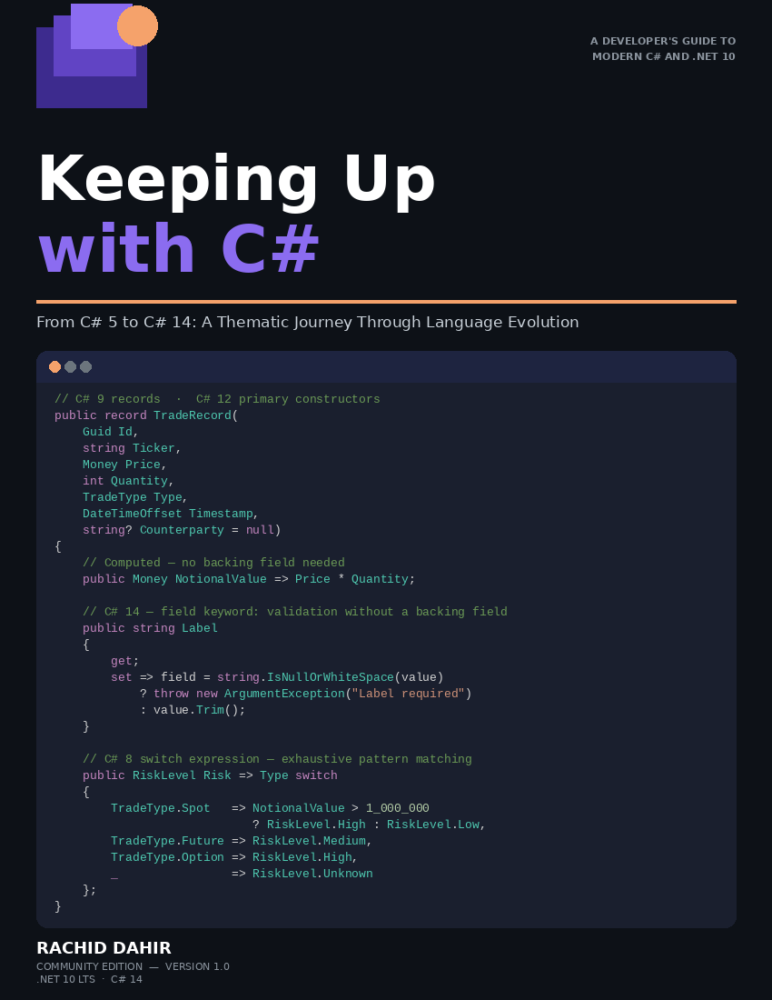

# Keeping Up with C#

<p align="center">
  
</p>

<p align="center"><strong>From C# 5 to C# 14: A Thematic Journey Through Language Evolution</strong></p>

<p align="center"><em>Seventy-six features across ten themes — the vocabulary of modern .NET.</em></p>

<p align="center">
  <strong>📖 <a href="#"><!-- TODO: replace with the real Leanpub URL -->Read on Leanpub (pay what you want)</a></strong>
</p>

<p align="center"><sub>The book itself is distributed exclusively through Leanpub. This repository hosts the companion code, errata, and reader feedback.</sub></p>

---

## What's in this book

C# is a different language than it was a decade ago. Records, pattern matching,
nullable reference types, `Span<T>`, source generators, generic math —
seventy-six features have shipped between C# 5 and C# 14, and most developers
have caught only a handful.

This book is the thematic tour. Each of the eleven chapters takes a theme —
expressiveness, data modeling, control flow, the type system, safety, memory,
interop, async, tooling — and walks through the features that compose into the
idioms modern .NET libraries actually use. The final chapter is a capstone of
seven composite patterns you'll recognise from Kestrel, ASP.NET Core, the BCL,
and every serious third-party library shipping today.

By the final chapter you'll have rebuilt your mental model of what idiomatic
C# looks like in 2026 — and you'll know which features to reach for in a
legacy codebase versus a greenfield project. Every snippet is anchored in one
of the five runnable companion projects in this repository.

## Table of Contents

| #    | Chapter                                          | Features (selected)                                                    |
|------|--------------------------------------------------|------------------------------------------------------------------------|
| 1    | The Foundation (C# 1–4)                          | Generics, LINQ, lambdas, `yield return`, extension methods             |
| 2    | Expressiveness & Boilerplate Reduction           | String interpolation, primary constructors, collection expressions, the `field` keyword |
| 3    | Data Modeling & Functional Techniques            | `record class` / `record struct`, init-only, with-expressions, required members |
| 4    | Evolution of Control Flow                        | Pattern matching, switch expressions, list patterns                    |
| 5    | Type System & OOP Flexibility                    | Default interface methods, static abstract members, generic math, extension members (C# 14) |
| 6    | Safety & Robustness                              | Nullable reference types, `CallerArgumentExpression`, `System.Threading.Lock` (C# 13) |
| 7    | Memory & Allocation Control (deep-dive)          | `Span<T>`, `stackalloc`, ref structs, `ArrayPool<T>`, UTF-8 string literals |
| 8    | Low-Level & Interop Primitives                   | `nint` / `nuint`, function pointers (`delegate*`), `[LibraryImport]`   |
| 9    | Asynchronous Programming Evolution (deep-dive)   | The state machine, `ValueTask<T>`, async streams, `Task.WhenEach` (.NET 9) |
| 10   | Compiler & Tooling Integration                   | Source generators (`IIncrementalGenerator`), interceptors, partial members |
| 11   | Modern C# in Practice — Capstone (deep-dive)     | Seven composite patterns combining features from all earlier themes    |
| A    | Migration & Adoption Guide                       | `LangVersion` vs. `TargetFramework`, NRT rollout, `.editorconfig`, four-tier priority matrix |
| B    | Feature Quick-Reference Index                    | All 76 features alphabetised with version, theme, project, and pattern mapping |

The book also ships with a 103-term keyword index and a populated table of contents.

## Who this book is for

> · *…have written C# for years and feel the language moved on without them*
> · *…came from Java, Go, TypeScript, or Rust and want the modern idioms*
> · *…lead a team deciding which features to adopt in a legacy codebase*

Every chapter assumes you can read C# 5 fluently. It does not assume you've
used anything past C# 7.

## Inside the companion code

Each project under [`CodeSample/`](./CodeSample) is self-contained — clone the
repo, `dotnet run` any project. You don't need to clone everything to follow
along; pick the project the chapter you're reading is anchored in.

| Project                                     | Themes         | What it demonstrates                                              |
|---------------------------------------------|----------------|-------------------------------------------------------------------|
| [QuantLite](./CodeSample/QuantLite)         | 0, 2, 3, 10    | Financial trade modeller — records, pattern matching, Immutable Data Pattern |
| [DevScripts](./CodeSample/DevScripts)       | 1, 9, 10       | Developer toolbox — string interpolation, primary ctors, a real `IIncrementalGenerator` |
| [ChatStream](./CodeSample/ChatStream)       | 5, 8, 10       | Real-time messaging — NRT, `Channel<T>` async pipelines, Null-Safe + Async Pipeline Patterns |
| [TypeForge](./CodeSample/TypeForge)         | 4, 10          | Type-system playground — generic math with `INumber<T>`, Generic Math Pattern |
| [PerfBench](./CodeSample/PerfBench)         | 6, 7, 10       | Benchmarking harness — `Span<T>`, `stackalloc`, BenchmarkDotNet, Zero-Allocation Pattern |

## Exercise solutions

The [`Exercises/`](./Exercises) folder is a separate Visual Studio solution
containing the full answers to every Practice Exercise in the book — 22
exercises across 11 chapters (Basic + Intermediate per chapter). One project
per chapter, each runnable on its own:

```bash
cd Exercises
dotnet build KeepUpCs.Exercises.sln

# run any chapter's Basic + Intermediate demos
dotnet run --project Exercises.Ch03
dotnet run --project Exercises.Ch09
```

Each answer is also walked through in **Appendix C — Exercise Solutions**
inside the book: the prompt, the answer code, an explanation of the
approach, and a Going Deeper callout on the subtler features used. The book
appendix and the Visual Studio solution mirror each other one-to-one.

## Sample snippet (front-cover code card)

This is the snippet shown on the front cover — drawn verbatim from QuantLite's
`ModernTrade.cs`. It fuses C# 9 records, C# 12 primary constructors, C# 14
`field` keyword, and a C# 8 switch expression with pattern matching in twelve
readable lines:

```csharp
// C# 9 records · C# 12 primary constructors
public record TradeRecord(
    Guid Id, string Ticker, Money Price,
    int Quantity, TradeType Type,
    DateTimeOffset Timestamp,
    string? Counterparty = null)
{
    // Computed — no backing field needed
    public Money NotionalValue => Price * Quantity;

    // C# 14 — field keyword: validation without a backing field
    public string Label
    {
        get;
        set => field = string.IsNullOrWhiteSpace(value)
            ? throw new ArgumentException("Label required")
            : value.Trim();
    }

    // C# 8 switch expression — exhaustive pattern matching
    public RiskLevel Risk => Type switch
    {
        TradeType.Spot   => NotionalValue > 1_000_000
                              ? RiskLevel.High : RiskLevel.Low,
        TradeType.Future => RiskLevel.Medium,
        TradeType.Option => RiskLevel.High,
        _                => RiskLevel.Unknown
    };
}
```

## Platform & Prerequisites

The book targets **.NET 10 LTS** (supported until November 2028) and **C# 14**.

You need exactly two things:

1. The **.NET 10 SDK** — install from [dot.net](https://dot.net).
2. A code editor — Visual Studio 2026, JetBrains Rider, VS Code with
   the C# Dev Kit, or `dotnet run` from any terminal.

## Errata & feedback

Found a typo, an outdated API, a code sample that doesn't compile, or a
factual mistake? Help make the next edition better:

- 📋 [**Open an errata report**](https://github.com/RachidD68/keeping-up-with-csharp/issues/new?template=errata.yml) — guided form that asks for the page number, chapter, and what's wrong.
- 🔍 [**Browse known errata**](https://github.com/RachidD68/keeping-up-with-csharp/issues?q=is%3Aissue+label%3Aerrata) — see what's already been reported before filing a duplicate.

For general feedback, questions about the companion code, or suggestions, use
[the Issues tab](https://github.com/RachidD68/keeping-up-with-csharp/issues)
without the `errata` label.

## License

- The **companion code** in this repository is released under the
  [MIT License](./LICENSE) — use it, fork it, build on it freely.
- The **book** itself is distributed through Leanpub under Community Edition
  terms. The full copyright page is inside the book.

---

<p align="center"><sub>Built with .NET 10 LTS · C# 14 · Last updated 2026</sub></p>
